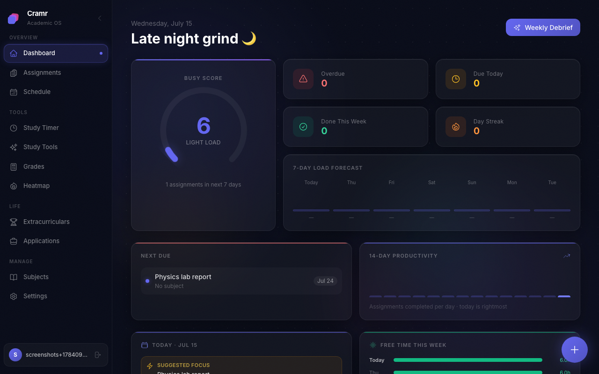
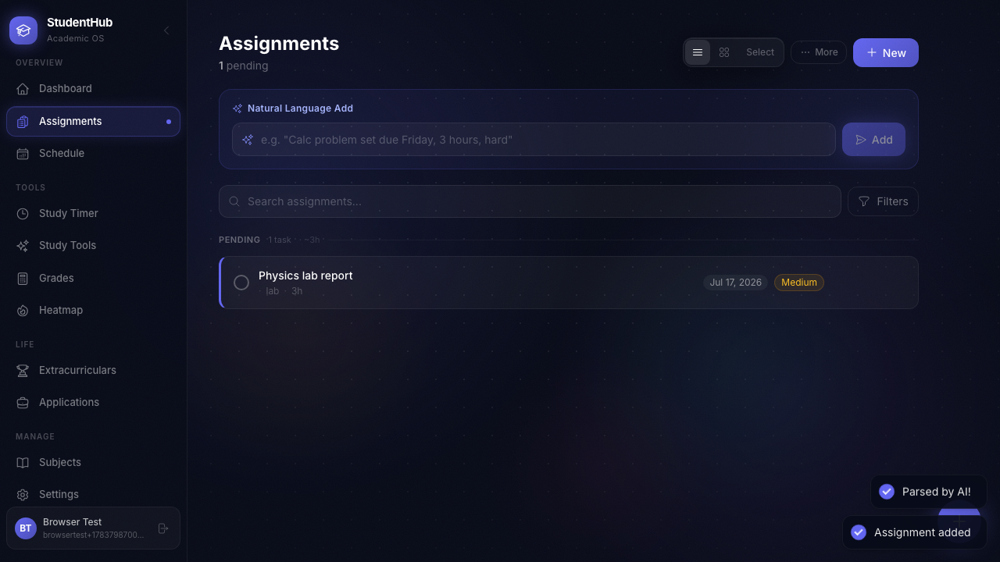
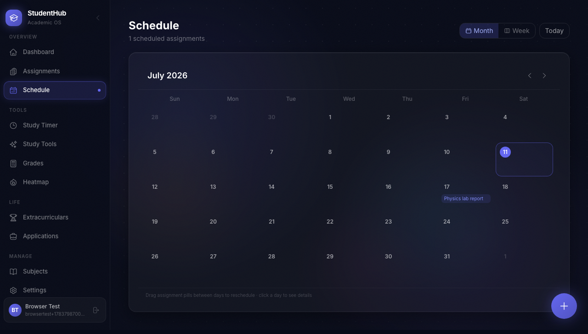
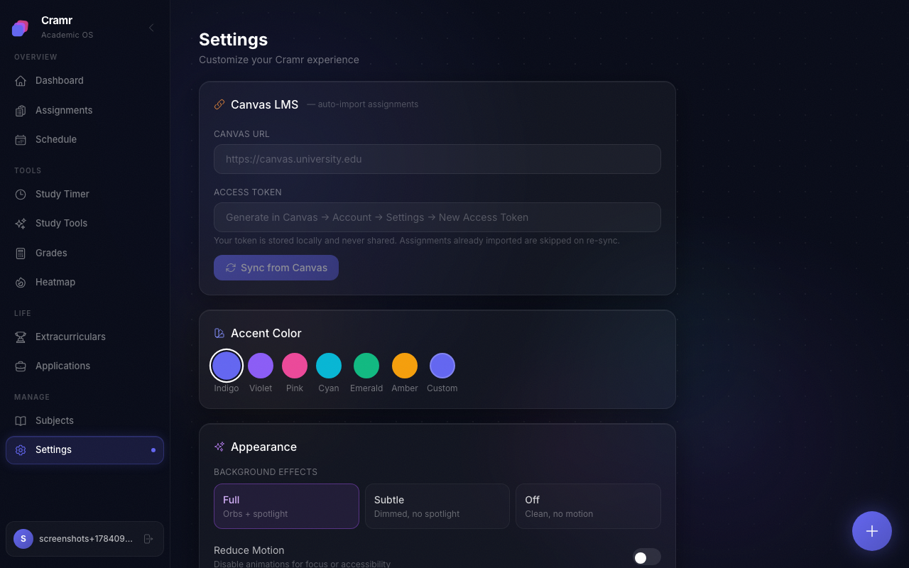

# Cramr

A full-stack academic command center for college students — deadlines, grades, study time, and workload all in one place, with AI woven in where it actually saves time.

**Live demo:** [studenthub-fawn.vercel.app](https://studenthub-fawn.vercel.app) — frontend on Vercel, API on Fly.io.



## Features

- **Busy Score** — a 0–100 workload gauge computed from real remaining hours, urgency, difficulty, and deadline clustering (not just a countdown).
- **Assignments** — full CRUD, subtasks, recurring assignments, drag-to-reschedule, and a natural-language add bar ("Calc problem set due Friday, 3 hours, hard" → a structured assignment via Gemini).
- **Schedule** — month/week calendar view of everything due.
- **Study Timer** — Pomodoro sessions linked to assignments and subjects, with a distraction-free Focus Mode.
- **Grades** — weighted grade components, what-you-need-on-the-final calculator, GPA tracking, and transcript import.
- **Study Tools** — turn pasted notes, uploaded files, or a YouTube transcript into summaries, study guides, or flashcards.
- **Canvas LMS sync** — pull assignments and grades in directly from Canvas.
- **Extracurriculars & Applications** — track clubs/jobs and internship/job applications alongside coursework.
- **Heatmap** — GitHub-style view of academic activity over the semester.
- **AI assistant** — day-by-day study plans, "what should I work on right now," and a weekly debrief.
- **PWA** — installable, with a service worker for offline shell caching.



## Tech Stack

**Frontend:** React 19 · Vite · React Router v6 · Tailwind CSS · Framer Motion · TanStack Query · Zustand

**Backend:** Node.js / Express (ESM) · better-sqlite3 · JWT auth (bcrypt) · Google Gemini API

**Infra:** Docker + docker-compose (nginx-served frontend, Node backend, persistent SQLite volume)



## Running locally

Requires Node 20+.

```bash
# Backend
cd backend
cp .env.example .env   # fill in GEMINI_API_KEY and JWT_SECRET
npm install
npm run dev             # http://localhost:3001

# Frontend (separate terminal)
cd frontend
cp .env.example .env     # defaults are fine for local dev
npm install
npm run dev             # http://localhost:5173
```

Generate a `JWT_SECRET` with:

```bash
openssl rand -hex 32
```

## Running with Docker

```bash
export JWT_SECRET=$(openssl rand -hex 32)
export GEMINI_API_KEY=your-key-here
docker-compose up --build
```

The frontend serves on port `80`, the API on `3001`. Data persists in a named Docker volume (`cramr-data`) so it survives container restarts.



## Project structure

```
backend/     Express API — routes, SQLite schema, AI integration, busy-score engine
frontend/    React app — pages, components, API client, PWA assets
docker-compose.yml
```
